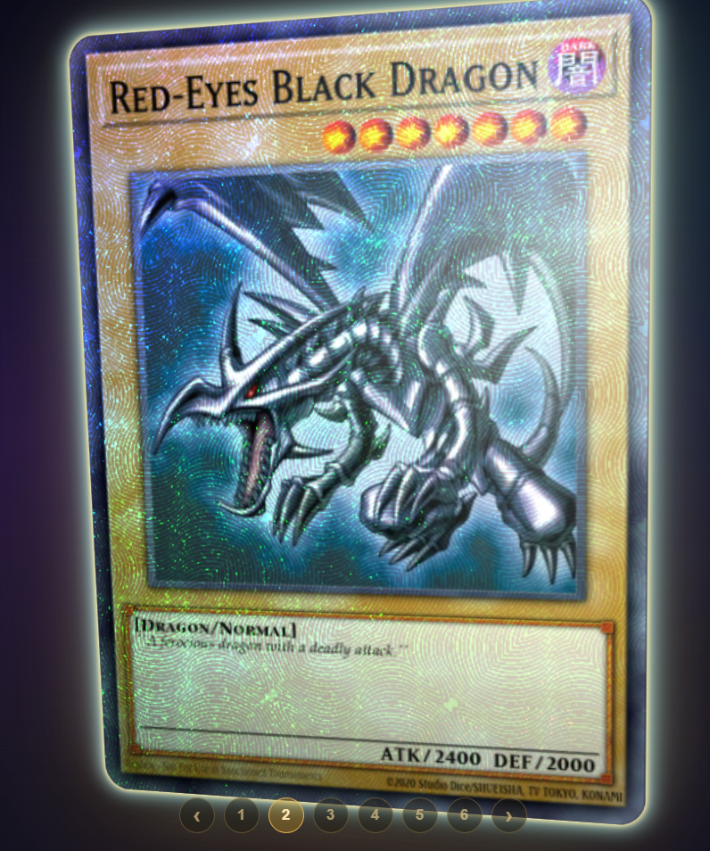
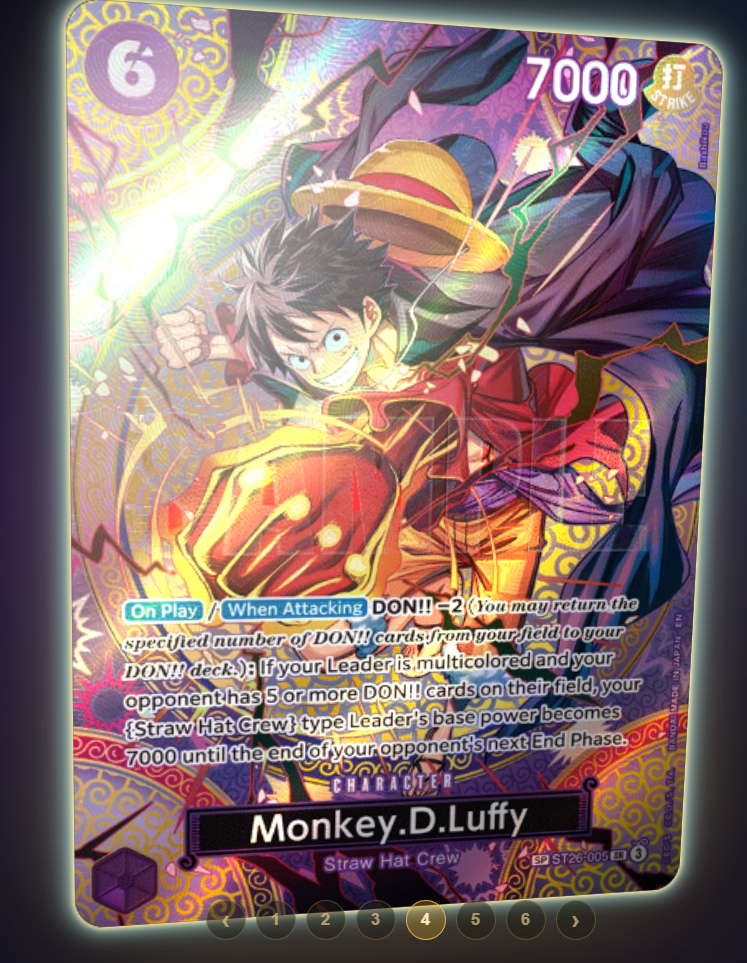

> **Credits / Based on:**
> - Demo: https://poke-holo.simey.me/
> - Source: https://github.com/simeydotme/pokemon-cards-css
>
> This project is cloned from the repo above. All holographic CSS effects are the work of [simeydotme](https://github.com/simeydotme).

---

# Multi-TCG Card Effects

Displays trading cards with 3D holographic CSS effects — built with Svelte + Vite.

**Live:** https://useless-inventions-meme-card-vercel.vercel.app/

| | |
|---|---|
|  |  |

> Architecture overview: [`multi-tcg-card-effects-hld.html`](multi-tcg-card-effects-hld.html)

## Cards (`src/Meme.svelte`)

Each card is defined in the `cards` array:

```js
const cards = [
  {
    img: "card-image-url",
    name: "Card Name",
    back: CARD_BACKS.pokemon,       // card back image
    effect: {
      rarity: "rare holo cosmos",   // holographic effect
      subtypes: "basic",
      supertype: "pokémon",
      trainerGallery: false,
    },
  },
];
```

### Card Backs (`CARD_BACKS`)

| Key | Source |
|-----|--------|
| `pokemon` | [Pokemon TCG](https://tcg.pokemon.com) |
| `digimon` | [Digimon Card Game](https://world.digimon.com/en/cardgame/) |
| `yugioh` | [Yugipedia](https://yugipedia.com) |
| `onepiece` | [BoardGameGeek](https://boardgamegeek.com) |

### Card Image Sources

| Card | Source |
|------|--------|
| Pikachu SWSH032 | [pokemontcg.io](https://pokemontcg.io) |
| Dark Magician | [YGOPRODeck](https://ygoprodeck.com) |
| Blue-Eyes White Dragon | [YGOPRODeck](https://ygoprodeck.com) |
| One Piece ST26-005 | [dotgg.gg](https://dotgg.gg) |
| TCGPlayer card | [TCGPlayer](https://tcgplayer.com) |
| Halu Abnormal | Original artwork |

---

## Card Effect Options (`effect.rarity`)

Controlled by CSS in `public/css/cards/`. Change the `rarity` value in the `cards` array to switch effects.

| `rarity` | Effect |
|----------|--------|
| `"rare holo v"` | V Holo — diagonal shimmer |
| `"rare holo cosmos"` | Cosmos Holo — galaxy stars |
| `"rare holo"` | Regular Holo — classic shimmer |
| `"rare holo vmax"` | VMax Holo |
| `"rare holo vstar"` | VStar Holo (requires `mask`) |
| `"rare rainbow"` | Rainbow — full spectrum |
| `"rare rainbow alt"` | Alternate rainbow |
| `"rare secret"` | Secret Rare |
| `"rare ultra"` | Ultra Rare / Full Art Trainer (requires `subtypes: "supporter"`) |
| `"amazing rare"` | Amazing Rare — green-gold |
| `"radiant rare"` | Radiant Rare |
| `"rare shiny"` | Shiny Rare |
| `"rare shiny v"` | Shiny V |
| `"rare shiny vmax"` | Shiny VMax |
| `"trainer gallery rare holo"` | Trainer Gallery Holo |

### Relevant subtypes

Some effects require a specific `subtypes` value:

| `subtypes` | Used by |
|------------|---------|
| `"v"` | `rare holo v` |
| `"vmax"` | `rare holo vmax` |
| `"supporter"` | `rare ultra` |
| `"basic"` | General / default |
| `"v-union"` | V-Union variant |

---

## URL

Card navigation via URL:
- `/` → card 1 (default)
- `/2`, `/3`, etc. → card N

Pagination (prev / numbers / next) is available at the bottom of the screen.

## Dev

```bash
npm install
npm run dev
```
